Author: Prof. Barbosa<br>
Contact: infobarbosa@gmail.com<br>
Github: [infobarbosa](https://github.com/infobarbosa)

# 01 - Ambiente Cloud9

Neste laboratório faremos uso recorrente do serviço Cloud9.

### 1. Verifique a região no topo à direita do console AWS, normalmente é **Norte da Virgínia**.<br>
**Não** altere essa configuração!
<div align="left">

 

</div>

### 2. Abra o console da AWS e na caixa de busca superior digite **Cloud9**.
<div align="left">


</div>

### 3. Clique no link Cloud9
<div align="left">

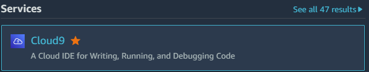

</div>

### 4. Clique em **Criar ambiente**
<div align="left">

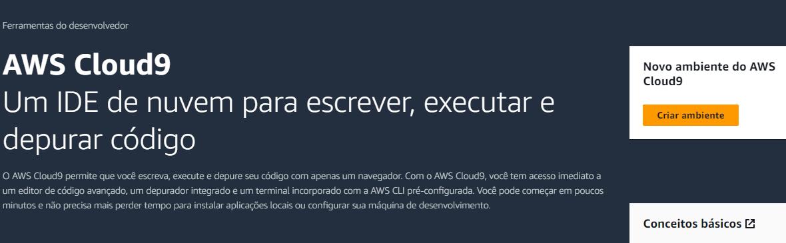

</div>

---
>Outra forma de acesso ao console Cloud9 é via menu "sanduíche" (três barras horizontais) logo abaixo do logo da AWS.
>
>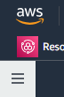
>
>Ao abrir o menu, clique então em **Meus ambientes**
>
> 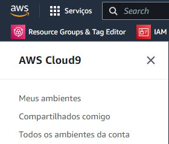
>
>Você será direcionado ao console do Cloud9 onde também está disponível o botão **Criar ambiente**
>
>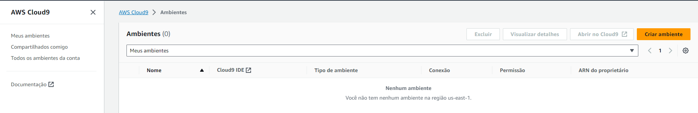
---

### 5. Será exibida a tela **Criar ambiente** confirme seguir.

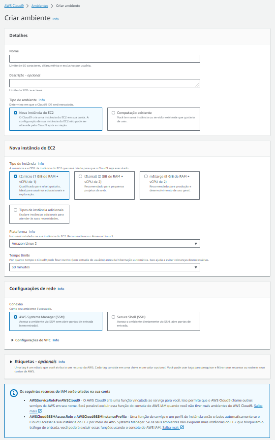

### 6. Campo **Nome**: informe `lab`.

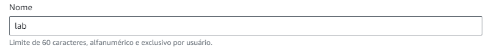

### 7. Campo **Descrição**: deixe em branco.

### 8. **Tipo de ambiente**: selecione `Nova instância do EC2`.

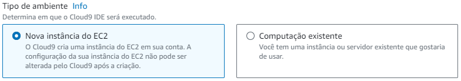

### 9. **Tipo instância**: selecione `t3.large`

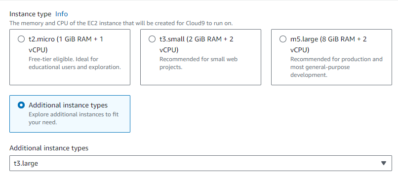

### 10. **Plataforma**: selecione `Ubuntu Server 22.04 LTS` 

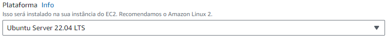

### 11. **Tempo limite**: selecione `1 hora`

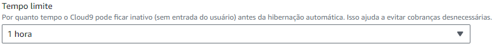

### 12. **Conexão**: deixe selecionado `Secure Shell (SSH)`

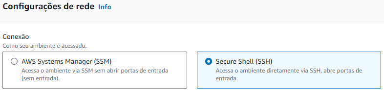

### 13. Clique em **Criar** ao final da página

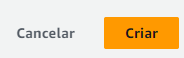

>Leva de 2 a 3 minutos para o ambiente ser criado. 

Ao ser criado, seu ambiente aparece no console do Cloud9
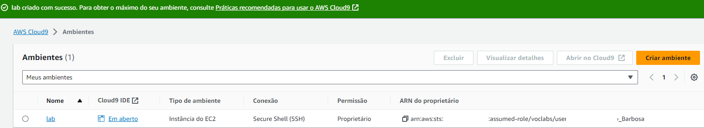

### 14. Para abrir o IDE do ambiente criado, clique em "Em aberto" conforme a seguir:

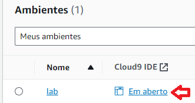

### 15. Uma nova aba será aberta com o IDE do Cloud9 criado:

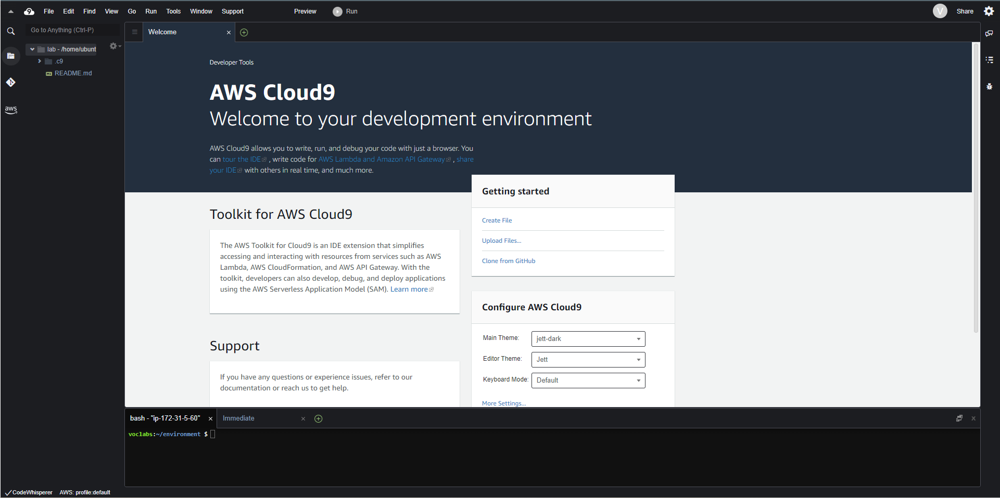

### 16. Clone do git deste laboratório:

```
git clone https://github.com/infobarbosa/mariadb-aws.git
```

O output será algo assim:
```
voclabs:~/environment $ git clone https://github.com/infobarbosa/mariadb-aws.git
Cloning into 'mariadb-aws'...
remote: Enumerating objects: 166, done.
remote: Counting objects: 100% (166/166), done.
remote: Compressing objects: 100% (106/106), done.
remote: Total 166 (delta 68), reused 137 (delta 39), pack-reused 0
Receiving objects: 100% (166/166), 15.43 MiB | 17.21 MiB/s, done.
Resolving deltas: 100% (68/68), done.
```


### 17. Navegue para o diretório raiz do projeto:

```
cd mariadb-aws/
```

### 18. Execute o script `setup_cloud9_env.sh` conforme a seguir:
```
sh scripts/setup_cloud9_env.sh
```

Esse script executa algumas tarefas administrativas importantes para esse laboratório.
- atualização de pacotes
- instalação do jq
- instalação do boto3
- redimensionamento de disco

O output será algo assim:

```
voclabs:~/environment $ cd mariadb-aws/
voclabs:~/environment/mariadb-aws (main) $ sh scripts/setup_cloud9_env.sh
### Atualizando o sistema ###
Get:1 http://us-east-1.ec2.archive.ubuntu.com/ubuntu jammy InRelease [270 kB]
Get:2 http://us-east-1.ec2.archive.ubuntu.com/ubuntu jammy-updates InRelease [119 kB]                                                                                                    
Get:3 http://us-east-1.ec2.archive.ubuntu.com/ubuntu jammy-backports InRelease [109 kB]     
...
...
### Reescrevendo a tabela de partição para uso full do espaço solicitado. ###
CHANGED: partition=1 start=227328 old: size=20744159 end=20971487 new: size=314345439 end=314572767
### Expandindo o tamanho do sistema de arquivos. ###
resize2fs 1.46.5 (30-Dec-2021)
Filesystem at /dev/nvme0n1p1 is mounted on /; on-line resizing required
old_desc_blocks = 2, new_desc_blocks = 19
The filesystem on /dev/nvme0n1p1 is now 39293179 (4k) blocks long.
```
### 19. Ao término da execução, é possível conferir o tamanho do disco através do comando `df -h`:

```
df -h
```

Output:

```
voclabs:~/environment/mariadb-aws (main) $ df -h
Filesystem       Size  Used Avail Use% Mounted on
/dev/root        146G  6.7G  139G   5% /
tmpfs            3.9G     0  3.9G   0% /dev/shm
tmpfs            1.6G  876K  1.6G   1% /run
tmpfs            5.0M     0  5.0M   0% /run/lock
/dev/nvme0n1p15  105M  6.1M   99M   6% /boot/efi
tmpfs            784M  4.0K  784M   1% /run/user/1000
voclabs:~/environment/mariadb-aws (main) $  
```

Parabéns! Seu ambiente Cloud9 está pronto pra uso!
